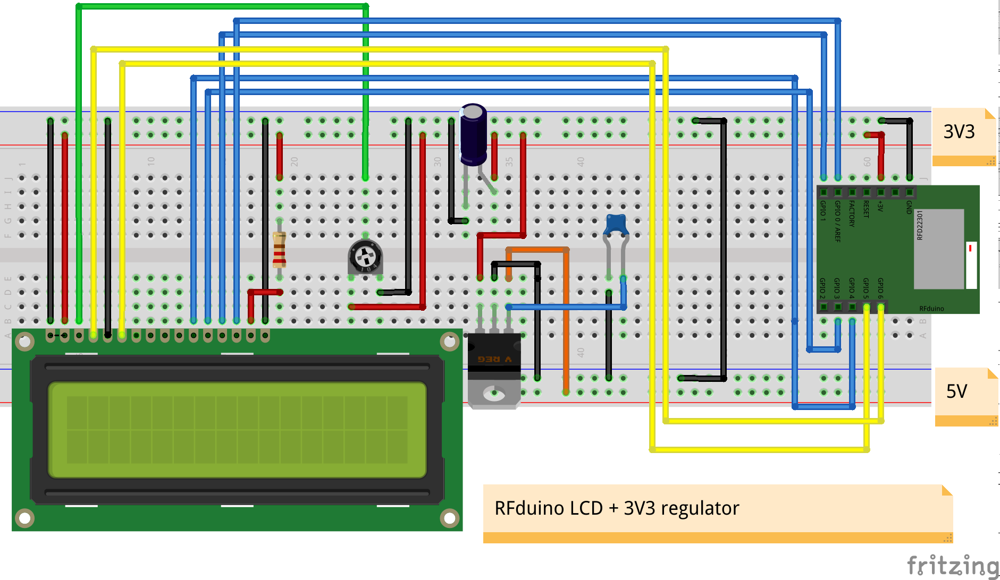

## Hardware Specifications

Button pusher device is composed of :
* a mechanical part : servomotor + bracket + support
* an hardware part : rfduino uc + servo shield + LCD panel + voltage regulator

Check [Bill of Materials file](./BOM.xls) for a concise list of all hardware elements used in that project & links to some providers

### Hardware Parts

* [RFduino uc module](http://www.rfduino.com/product/rfd22102-rfduino-dip/index.html)

* [RFduino servo module](http://www.rfduino.com/product/rfd22123-servo-shield-for-rfduino/index.html)

* [3V3 NewHaven LCD panel](http://www.mouser.fr/Search/ProductDetail.aspx?R=NHD-0216SZ-NSW-BBW-33V3virtualkey66010000virtualkey763-0216SZNSWBBW33V3)

* [5V to 3V3 Voltage regulator LD1117V33](http://www.mouser.fr/ProductDetail/STMicroelectronics/LD1117V33/?qs=sGAEpiMZZMvHdo5hUx%252bJYl1lUmOd3DGr)

* [Rfduino UART module](http://www.rfduino.com/product/rfd22121-usb-shield-for-rfduino/index.html) (for uploading/debgging purpose)

### Prototype wiring 

### Mechanical Parts

This device is meant to push a wall switch of "Mosaic" type which is harder to push than a regular wall switch. To have enough force to push it, a servomotor with High Torque is used. HS-625MG is good for this task with a torque of 5.5 / 6.8 kg (http://www.imagesco.com/servo/motors/HS-625MG.html).

An aluminium sheet is used to support this servomotor : 

Servomotor is fixed to the bracket, the bracket is fixed to this plate :

You can use 3.5mm or 4.mm screws with imagesco bracket (http://www.imagesco.com/catalog/servobot/SUB-01.pdf) :

The servomotor is then connected to Rfduino servo shield module that features an external 5V DC supply :

