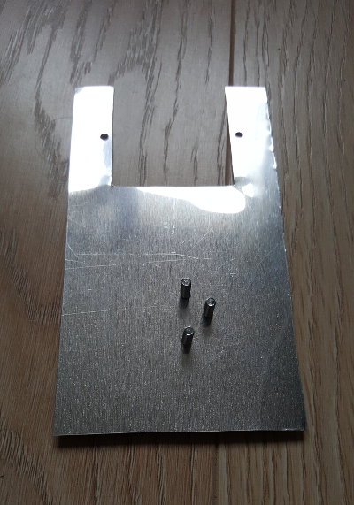
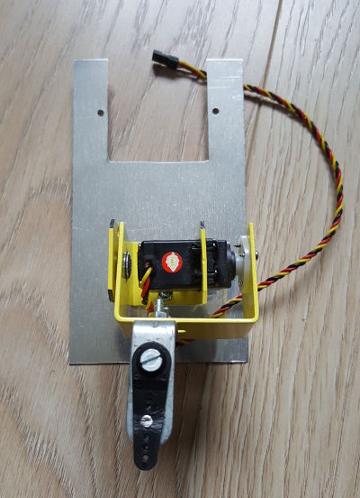
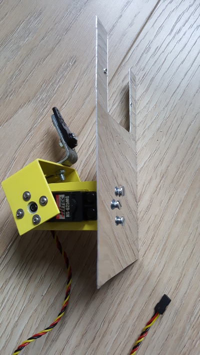
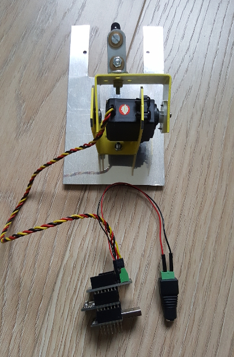

## Hardware Specifications

Button pusher device is composed of :
* a mechanical part : servomotor + bracket + support
* an hardware part : rfduino uc + servo shield + LCD panel + voltage regulator

This device is meant to push a wall switch of "Mosaic" type which is harder to push than a regular wall switch. To have enough force to push it, a servomotor with High Torque is used. HS-625MG is good for this task with a torque of 5.5 / 6.8 kg (http://www.imagesco.com/servo/motors/HS-625MG.html).

An aluminium sheet is used to support this servomotor : 

Servomotor is fixed to the bracket, the bracket is fixed to this plate :

You can use 3.5mm or 4.mm screws with imagesco bracket (http://www.imagesco.com/catalog/servobot/SUB-01.pdf) :

The servomotor is then connected to Rfduino servo shield module that features an external 5V DC supply :

